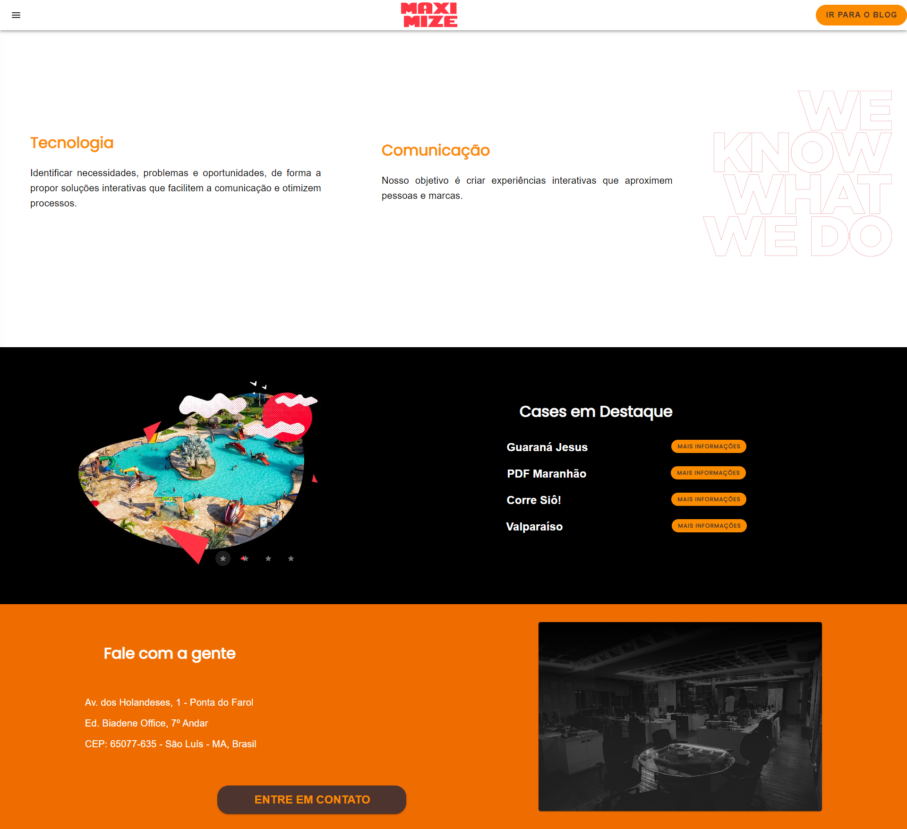
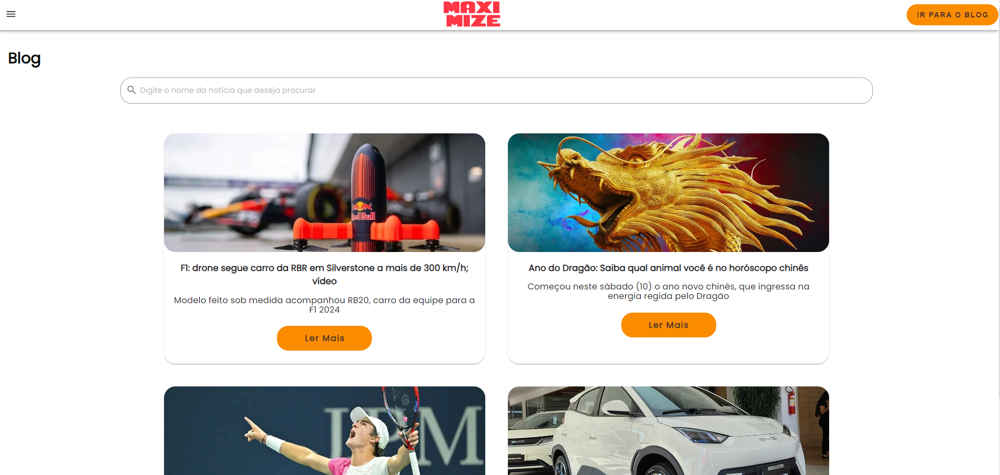
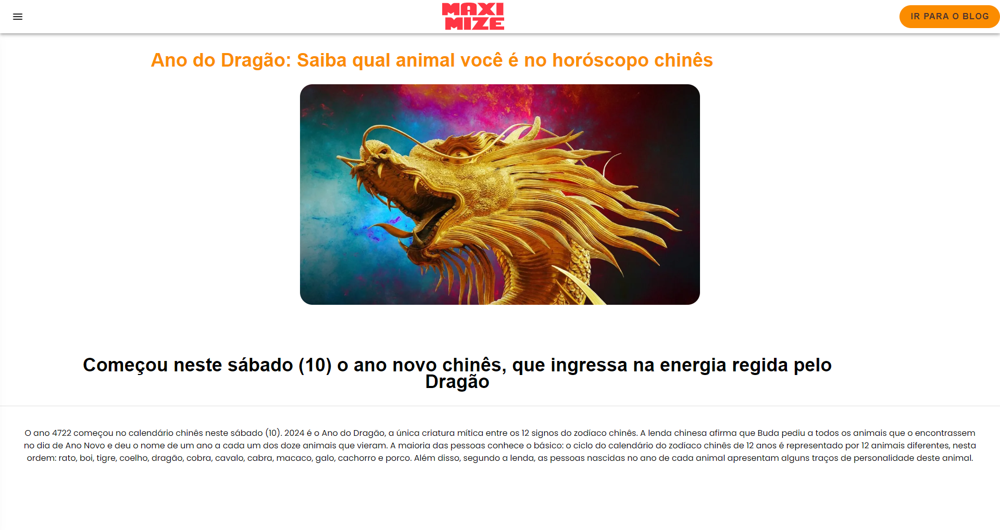

## MAXIMIZE NEWS - TELA INICIAL

Foram desenvolvidas três telas para interação com o usuário. A primeira tela apresenta informações sobre a empresa MAXIMIZE, que atua em diversos setores da economia, incluindo comunicação digital, gerenciamento de redes sociais, tecnologia com cloud computing, solution selling e eCommerce. 

A tela inicial também destaca alguns casos de sucesso da empresa, oferecendo aos usuários a opção de obter mais informações sobre esses projetos por meio de um botão de redirecionamento. Além disso, o site disponibiliza informações detalhadas sobre a empresa, juntamente com um botão para contato direto através do "Fale Conosco".

<div align="center">

</div>

## BLOG

Na tela do blog, os usuários podem visualizar todos os cards provenientes do banco de dados da API MAXIMIZE NEWS. 
Esses cards são exibidos em ordem decrescente, do mais recente ao mais antigo, e incluem campos como título, descrição, imagem e um botão para ler a matéria completa. 

Os cards são renderizados lado a lado, permitindo que dois deles sejam exibidos simultaneamente. 
Além disso, ao passar o mouse sobre os cards, ocorre um efeito de animação para proporcionar uma experiência visual mais interativa.


<div align="center">

</div>


## MATÉRIA COMPLETA

Ao clicar em um card, o usuário é direcionado para uma nova página que apresenta todas as informações relacionadas àquela matéria específica.

<div align="center">

</div>

## ▶️ COMO EXECUTAR O PROJETO

- O projeto API MAXIMIZE NEWS (BACKEND) precisa estar em execução.

- Clonar o repositório https://github.com/EduardoPSRodrigues/Maximize-FrontEnd

- Depois de clonar o repositório, abra o projeto e no terminal execute o comando:

```sh
npm install
```

- Para deixar o site online, basta executar o comando:

```sh
npm run dev
```
